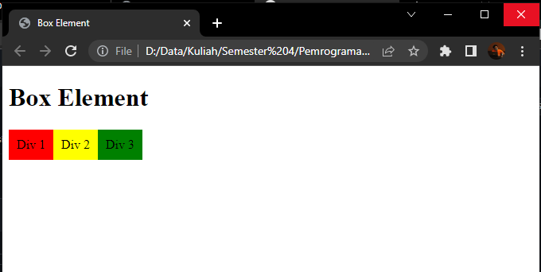
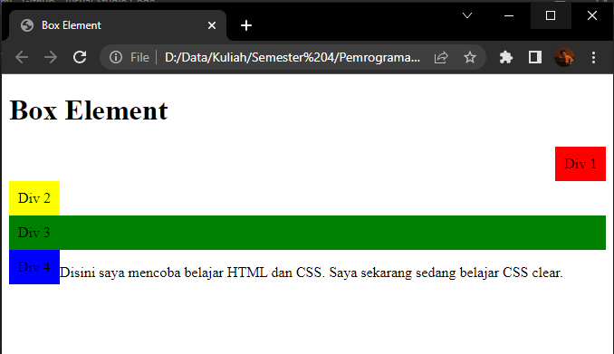
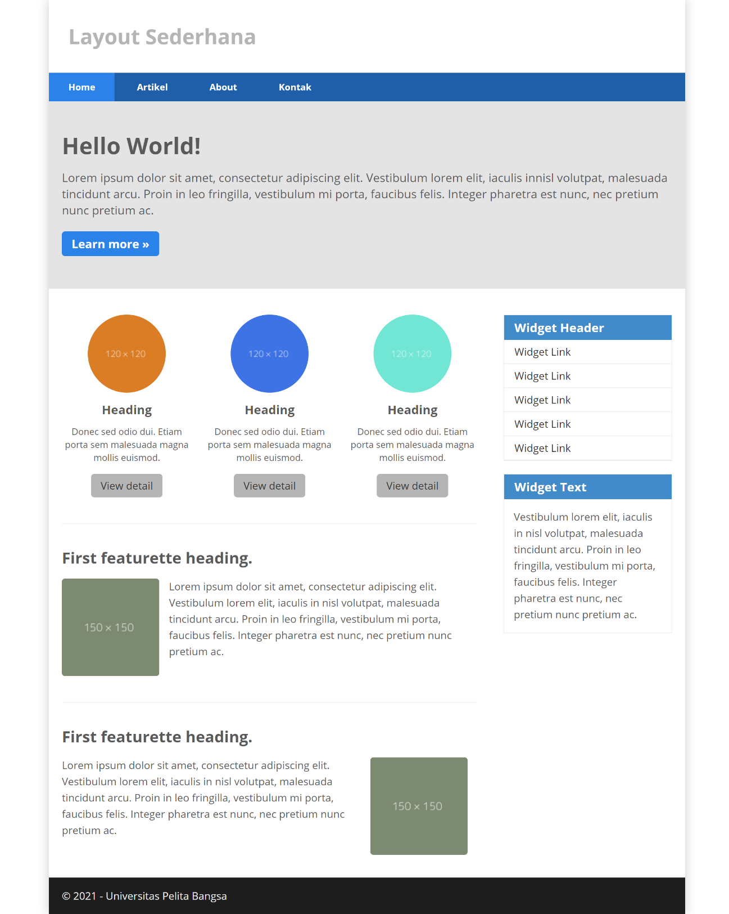

# Lab4Web

## Tugas Praktikum 4

Nama    : Faza Ardan Kusuma <br>
NIM     : 312010001<br>
Kelas   : TI 20 B1

<hr>

## Membuat Box Element

Buat file html dengan nama file <b>lab4_box.html</b>. Lalu disiapkan seperti biasa dan tambahkan syntax untuk membuat box element beserta CSSnya, maka berikut syntaxnya :<br>
```
<!DOCTYPE html>
<html lang="en">
<head>
    <meta charset="UTF-8">
    <meta http-equiv="X-UA-Compatible" content="IE=edge">
    <meta name="viewport" content="width=device-width, initial-scale=1.0">
    <title>Box Element</title>
</head>
<body>
    <header>
        <h1>Box Element</h1>
    </header>
    <section> 
        <div class="div1">Div 1</div> 
        <div class="div2">Div 2</div> 
        <div class="div3">Div 3</div> 
    </section>
    <style> 
        div {
            float:left; 
            padding: 10px; 
        } 
        .div1 { 
            background: red; 
        } 
        .div2 { 
            background: yellow; 
        } 
        .div3 { 
            background: green; 
        } 
    </style>
</body>
</html>
```
Tampilan :<br>
<br>

Disini saya mencoba dengan mengubah <b>Clear</b> dan <b>float</b> dengan nilai lainnya, berikut saya rubah syntaxnya menjadi : <br>
```
    <style> 
        div {
            padding: 10px; 
            float: none;
        } 
        .div1 { 
            background: red;
            clear: left;
            float: right 
        } 
        .div2 { 
            background: yellow;
            clear: right;
            float: left;
        } 
        .div3 { 
            background: green;
            clear: both;
            float: none;
        }
        .div4 { 
            background-color: blue; 
            clear: right;
            float: left 
        }
    </style>
```

Tampilannya menjadi :<br>
<br>

Dari hasil percobaan tersebut, ketika float diisi dengan nilai <b>left</b> maka kolom warna posisinya akan ada di sebelah kiri(<i>Div 1</i>), bila dengan nilai <b>right</b> maka kolom warna akan ada di sebelah kanan (<i>Div 2</i>), bila diisi dengan <b>none</b> maka kolom warna menjadi sepanjang line tersebut (<i>Div 3</i>). 

## Membuat Layout Sederhana

Saya akan membuat layout sederhana seperti berikut : <br>
<br>

