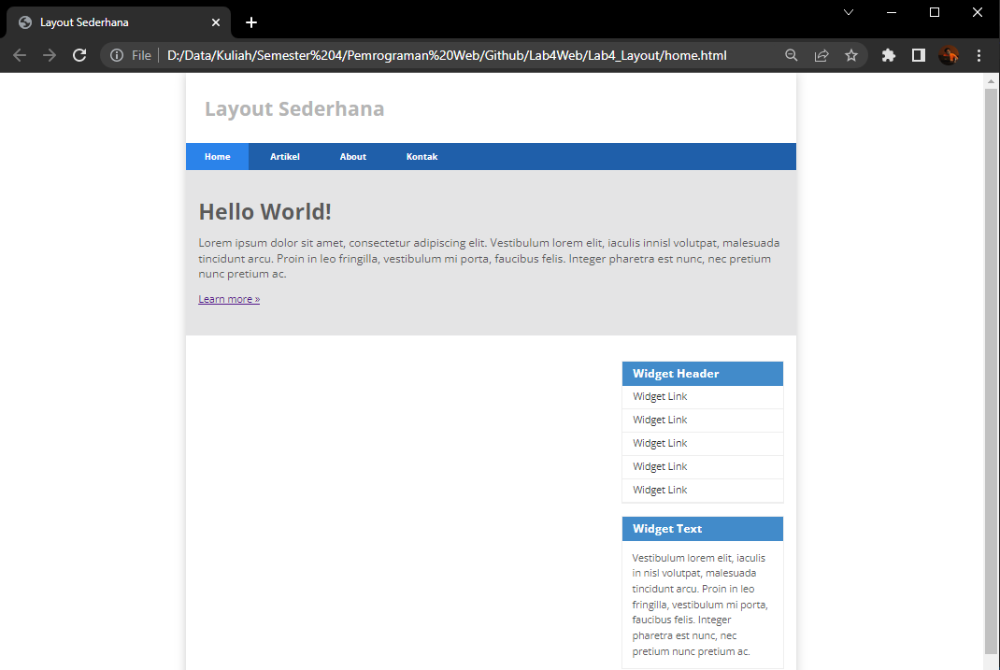

# Lab4Web

## Tugas Praktikum 4

Nama    : Faza Ardan Kusuma <br>
NIM     : 312010001<br>
Kelas   : TI 20 B1

<hr>

## Membuat Box Element

Buat file html dengan nama file <b>lab4_box.html</b>. Lalu disiapkan seperti biasa dan tambahkan syntax untuk membuat box element beserta CSSnya, maka berikut syntaxnya :<br>
```
<!DOCTYPE html>
<html lang="en">
<head>
    <meta charset="UTF-8">
    <meta http-equiv="X-UA-Compatible" content="IE=edge">
    <meta name="viewport" content="width=device-width, initial-scale=1.0">
    <title>Box Element</title>
</head>
<body>
    <header>
        <h1>Box Element</h1>
    </header>
    <section> 
        <div class="div1">Div 1</div> 
        <div class="div2">Div 2</div> 
        <div class="div3">Div 3</div> 
    </section>
    <style> 
        div {
            float:left; 
            padding: 10px; 
        } 
        .div1 { 
            background: red; 
        } 
        .div2 { 
            background: yellow; 
        } 
        .div3 { 
            background: green; 
        } 
    </style>
</body>
</html>
```
Tampilan :<br>
<br>

Disini saya mencoba dengan mengubah <b>Clear</b> dan <b>float</b> dengan nilai lainnya, berikut saya rubah syntaxnya menjadi : <br>
```
    <style> 
        div {
            padding: 10px; 
            float: none;
        } 
        .div1 { 
            background: red;
            clear: left;
            float: right 
        } 
        .div2 { 
            background: yellow;
            clear: right;
            float: left;
        } 
        .div3 { 
            background: green;
            clear: both;
            float: none;
        }
        .div4 { 
            background-color: blue; 
            clear: right;
            float: left 
        }
    </style>
```

Tampilannya menjadi :<br>
<br>

Dari hasil percobaan tersebut, ketika float diisi dengan nilai <b>left</b> maka kolom warna posisinya akan ada di sebelah kiri(<i>Div 1</i>), bila dengan nilai <b>right</b> maka kolom warna akan ada di sebelah kanan (<i>Div 2</i>), bila diisi dengan <b>none</b> maka kolom warna menjadi sepanjang line tersebut (<i>Div 3</i>). 

## Membuat Layout Sederhana

### Membuat file HTML

Saya akan membuat layout sederhana seperti berikut : <br>
<br>

Pertama, buat folder baru dengan nama <b>Lab4_Layout</b>. Lalu buat file html baru didalamnya dengan dengan nama <b>home.html</b> dan buat kerangka layout dengan semantics element seperti berikut.<br>
<br>
Maka syntaxnya seperti berikut :<br>
```
<!DOCTYPE html>
<html lang="en">
<head>
    <meta charset="UTF-8">
    <meta http-equiv="X-UA-Compatible" content="IE=edge">
    <meta name="viewport" content="width=device-width, initial-scale=1.0">
    <title>Layout Sederhana</title>
    <link rel="stylesheet" href="style.css">
</head>
<body>
    <div id="container">
        <header> 
            <h1>Layout Sederhana</h1> 
        </header> 
        <nav> 
            <a href="home.html" class="active">Home</a> 
            <a href="artikel.html">Artikel</a> 
            <a href="about.html">About</a> 
            <a href="kontak.html">Kontak</a> 
        </nav> 
        <section id="hero"></section> 
        <section id="wrapper"> 
            <section id="main"></section> 
            <aside id="sidebar"></aside> 
        </section> 
        <footer> 
            <p>&copy; 2021 - Universitas Pelita Bangsa</p> 
        </footer>
    </div>
    
</body>
</html>
```
Hasil dari syntax terserbut :<br>
<br>

### Menambahkan File CSS
Untuk membuat tampilan menjadi lebih bagus, maka tambahkan CSS. Buat file CSS dengan nama <b>Style.css</b>.<br>
Lalu masukan syntax berikut.<br>
```
/* import google font */ 
@import 
url('https://fonts.googleapis.com/css2?family=Open+Sans:ital,wght@0,300;0,400;0,600;0,700;0,800;1,300;1,400;1,600;1,700;1,800&display=swap'); 
@import 
url('https://fonts.googleapis.com/css2?family=Open+Sans+Condensed:ital,wght@0,300;0,700;1,300&display=swap'); 

/* Reset CSS */ 
* { 
    margin: 0; 
    padding: 0; 
} 
body { 
    line-height:1; 
    font-size:100%; 
    font-family:'Open Sans', sans-serif; 
    color:#5a5a5a; 
} 
#container { 
    width: 980px; 
    margin: 0 auto; 
    box-shadow: 0 0 1em #cccccc; 
} 

/* header */ 
header { 
    padding: 20px; 
} 
header h1 { 
    margin: 20px 10px; 
    color: #b5b5b5; 
}
```
Maka tampilannya akan berubah menjadi seperti berikut :<br>
<br>

### Membuat Navigasi

Kemudian, saya akan buat navigasinya agar lebih enak dilihat dengan menambahkan CSS berikut :<br>
```
/* header */ 
header { 
    padding: 20px; 
} 
header h1 { 
    margin: 20px 10px; 
    color: #b5b5b5; 
}

/* navigasi */ 
nav { 
    display: block; 
    background-color: #1f5faa; 
} 
nav a { 
    padding: 15px 30px; 
    display: inline-block; 
    color: #ffffff; 
    font-size: 14px; 
    text-decoration: none; 
    font-weight: bold; 
} 
nav a.active, 
nav a:hover { 
    background-color: #2b83ea; 
}
```

Tampilan outputya :<br>
<br>

### Membuat Hero Panel
Selanjutnya saya akan membuat hero panel. Tambahkan syntax berikut kedalam file html.<br>
```
<section id="hero">
    <h1>Hello World!</h1> 
    <p>Lorem ipsum dolor sit amet, consectetur adipiscing elit. Vestibulum lorem elit, iaculis innisl volutpat, malesuada tincidunt arcu. Proin in leo fringilla, vestibulum mi porta, faucibus felis. Integer pharetra est nunc, nec pretium nunc pretium ac.</p> 
    <a href="home.html" class="btn btn-large">Learn more &raquo;</a>
    </section>
```

Tampilan outputnya menjadi seperti berikut :<br>
<br>

Lalu rapikan dengan menambahkan CSS. Tambahkan syntax berikut kedalam file CSS.<br>
```
/* Hero Panel */ 
#hero { 
    background-color: #e4e4e5; 
    padding: 50px 20px; 
    margin-bottom: 20px; 
} 
#hero h1 { 
    margin-bottom: 20px; 
    font-size: 35px; 
} 
#hero p { 
    margin-bottom: 20px; 
    font-size: 18px; 
    line-height: 25px; 
}
```

Maka tampilannya akan berubah menjadi :<br>
<br>

### Mengatur Layout Main dan Sidebar
Selanjutnya mengatur Main Content dan Sidebar agar tampilan lebih baik. Tambahkan syntax berikut kedalam file CSS.<br>
```
/* main content */ 
#wrapper { 
    margin: 0; 
}
#main { 
    float: left; 
    width: 640px; 
    padding: 20px; 
} 

/* sidebar area */ 
#sidebar { 
    float: left; 
    width: 260px; 
    padding: 20px; 
}
```
Tampilan outputnya :<br>
<br>

### Membuat Sidebar
Kemudian akan saya tambahkan Sidebar Widget. Tambahkan syntax berikut kedalam file html.<br>
```
<aside id="sidebar">
    <div class="widget-box"> 
        <h3 class="title">Widget Header</h3> 
            <ul> 
                <li><a href="#">Widget Link</a></li> 
                <li><a href="#">Widget Link</a></li> 
                <li><a href="#">Widget Link</a></li> 
                <li><a href="#">Widget Link</a></li> 
                <li><a href="#">Widget Link</a></li> 
            </ul> 
    </div> 
    <div class="widget-box"> 
        <h3 class="title">Widget Text</h3> 
        <p>Vestibulum lorem elit, iaculis in nisl volutpat, malesuada tincidunt arcu. Proin in leo fringilla, vestibulum mi porta, faucibus felis. Integer pharetra est nunc, nec pretium nunc pretium ac.</p> 
    </div>
```
Tampilan output :<br>
<br>

Selanjutnya tambahkan CSS pada sidebar agar tampilannya lebih rapi dengan syntax berikut :<br>
```
/* widget */ 
.widget-box { 
    border:1px solid #eee; 
    margin-bottom:20px; 
} 
.widget-box .title { 
    padding:10px 16px; 
    background-color:#428bca; 
    color:#fff; 
} 
.widget-box ul { 
    list-style-type:none; 
} 
.widget-box li { 
    border-bottom:1px solid #eee;
} 
.widget-box li a { 
    padding:10px 16px; 
    color:#333; 
    display:block; 
    text-decoration:none; 
} 
.widget-box li:hover a { 
    background-color:#eee; 
} .widget-box p {
    padding:15px; 
    line-height:25px; 
}
```
Maka tampilannya berubah menjadi seperti berikut : <br>
<br>

### Mengatur Footer
Untuk mengatur footer agar tampilannya lebih rapi, tambahkan CSS untuk footer.
```
/* footer */ 
footer { 
    clear:both; 
    background-color:#1d1d1d; 
    padding:20px; 
    color:#eee; 
}
```

Outputnya :<br>
<br>

### Menambahkan Elemen lain pada Main Content
Disini saya akan menambahkan elemen lain agar tampilannya lebih meriah, berikut syntax htmlnya.<br>
```
<section id="main">
    <div class="row"> 
        <div class="box"> 
             
            <h3>Heading</h3> 
            <p>Donec sed odio dui. Etiam porta sem malesuada magna mollis euismod.</p> 
            <a href="#" class="btn btn-default">View detail</a> 
        </div> 
        <div class="box"> 
             
            <h3>Heading</h3> 
            <p>Donec sed odio dui. Etiam porta sem malesuada magna mollis euismod.</p> 
            <a href="#" class="btn btn-default">View detail</a> 
        </div> <div class="box"> 
             
            <h3>Heading</h3> 
            <p>Donec sed odio dui. Etiam porta sem malesuada magna mollis euismod.</p> 
            <a href="#" class="btn btn-default">View detail</a> 
        </div> 
    </div>
</section>
```

Tampilan output :<br>
<br>

Lalu tambahkan CSS agar lebih rapi, berikut syntaxnya :<br>
```
/* box */ 
.box { 
    display:block; 
    float:left; 
    width:33.333333%; 
    box-sizing:border-box; 
    -moz-box-sizing:border-box; 
    -webkit-box-sizing:border-box;
    padding:0 10px; 
    text-align:center; 
} 
.box h3 { 
    margin: 15px 0; 
} 
.box p { 
    line-height: 20px; 
    font-size: 14px; 
    margin-bottom: 15px; 
} 
box img { 
    border: 0; 
    vertical-align: middle; 
} 
.image-circle { 
    border-radius: 50%; 
} 
.row { 
    margin: 0 -10px; 
    box-sizing: border-box; 
    -moz-box-sizing: border-box; 
    -webkit-box-sizing: border-box; 
} 
.row:after, .row:before, 
.entry:after, .entry:before { 
    content:''; 
    display:table; 
} 
.row:after, 
.entry:after { 
    clear:both; 
}
```

Tampilan output :<br>
<br>

### Menambahkan Content Article
Selanjutnya saya akan menambahkan <i>Content Article</i>. Tambahkan syntax html berikut pada <i>Main Content</i>.
```
<hr class="divider" /> 
<article class="entry"> 
    <h2>First featurette heading.</h2> 
     
    <p>Lorem ipsum dolor sit amet, consectetur adipiscing elit. Vestibulum lorem elit, iaculis in nisl volutpat, malesuada tincidunt arcu. Proin in leo fringilla, vestibulum mi porta, faucibus felis. Integer pharetra est nunc, nec pretium nunc pretium ac.</p> 
</article> <hr class="divider" /> 
<article class="entry"> 
    <h2>First featurette heading.</h2> 
     
    <p>Lorem ipsum dolor sit amet, consectetur adipiscing elit. Vestibulum lorem elit, iaculis in nisl volutpat, malesuada tincidunt arcu. Proin in leo fringilla, vestibulum mi porta, faucibus felis. Integer pharetra est nunc, nec pretium nunc pretium ac.</p> 
</article> 
```

Selanjutnya saya akan menambahkan CSS untuk artikelnya. Tambahkan syntax berikut kedalam file CSS :<br>
```
.divider { 
    border:0; 
    border-top:1px solid #eeeeee; 
    margin:40px 0; 
} 
/* entry */ 
.entry { 
    margin: 15px 0; 
} 
.entry h2 { 
    margin-bottom: 20px;
} 
.entry p { 
    line-height: 25px; 
} 
.entry img { 
    float: left; 
    border-radius: 5px; 
    margin-right: 15px; 
} 
.entry .right-img { 
    float: right; 
}
```

Tampilan Outputnya : <br>
<br>

Itulah cara membuat layout sederhana

<hr>

## Pertanyaan dan Tugas
1. Tambahkan Layout untuk menu About<br>
=> buat single layout yang berisi deskripsi, portfolio, dll
2. Tambahkan layout untuk menu Contact<br>
=> yang berisi form isian: nama, email, message, dll
